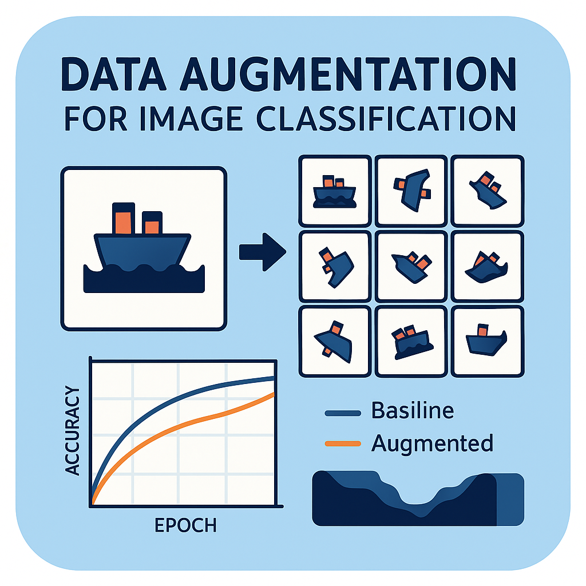

# 💫 Hey! I'm Nabih, CS graduate from UTA:
💻 Computer Science graduate from the University of Texas at Arlington, December 2025
📊 Interested in machine learning, data science, and backend systems
🧠 Enjoy turning data and ideas into practical, real world solutions
🚀 Actively building projects that challenge me and sharpen my skills
🔍 Check out my work below

## 🌐 Socials:
   

# 💻 Tech Stack:
                              

<picture>
  <source media="(prefers-color-scheme: dark)" srcset="https://raw.githubusercontent.com/tobiasmeyhoefer/tobiasmeyhoefer/output/github-snake-dark.svg" />
  <source media="(prefers-color-scheme: light)" srcset="https://raw.githubusercontent.com/tobiasmeyhoefer/tobiasmeyhoefer/output/github-snake.svg" />
  
</picture>

## 🚀 Build Zone

<table>
  <tr>
    <td align="center" width="50%">
       
      <strong>BestPriceStore: Database & Website</strong> 
      <a href="https://github.com/MohNabih1/MyWorkshop.git">🔗 Check it out</a> 
      A web-based inventory and vendor management system backed by a normalized SQL database and PHP interface.
    </td>
    <td align="center" width="50%">
       
      <strong>Transaction Manager – Concurrency Control Simulation</strong> 
      <a href="https://github.com/MohNabih1/MyWorkshop.git">🔗 Check it out</a> 
      Simulates database concurrency control using Strict 2PL, lock management, and transaction logging.
    </td>
  </tr>
  <tr>
    <td align="center" width="50%">
       
      <strong>B+ Tree Implementation: Index File Organization for DBMS MINIBASE</strong> 
      <a href="https://github.com/MohNabih1/MyWorkshop.git">🔗 Check it out</a> 
      Implements B+ Tree index structure integrated into MINIBASE to simulate file organization in database systems.
    </td>
    <td align="center" width="50%">
       
      <strong>QuickFin: Financial Helper App</strong> 
      <a href="https://github.com/MohNabih1/MyWorkshop.git">🔗 Check it out</a> 
      A Kotlin-based Android app for tip calculation, currency conversion, investment growth, and loan interest.
    </td>
  </tr>
  <tr>
    <td align="center" width="50%">
       
      <strong>IMDb Data Analysis using Hadoop and SQL</strong> 
      <a href="https://github.com/MohNabih1/MyWorkshop.git">🔗 Check it out</a> 
      Analyzed movie genre trends with Hadoop MapReduce and SQL on a 50M-row Oracle IMDb dataset.
    </td>
    <td align="center" width="50%">
       
      <strong>CNN Augmentation Analysis – Image Classification Study</strong> 
      <a href="https://github.com/MohNabih1/MyWorkshop.git">🔗 Check it out</a> 
      Improved CNN accuracy on CIFAR-10 by 1.7% using data augmentation with PyTorch and per-class analysis.
    </td>
  </tr>
</table>

# 📊 GitHub Stats:
 
 

  

## 🏆 GitHub Trophies

### ✍️ Random Dev Quote

### 🔝 Top Contributed Repo

---

<!-- Proudly created with GPRM ( https://gprm.itsvg.in ) -->
